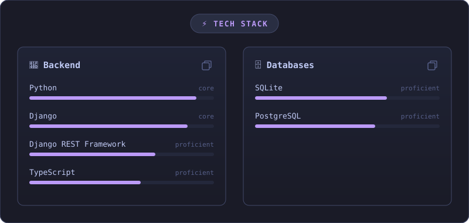
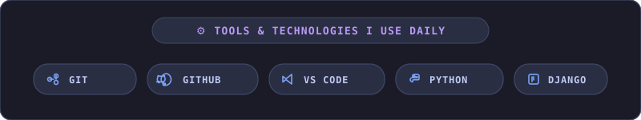
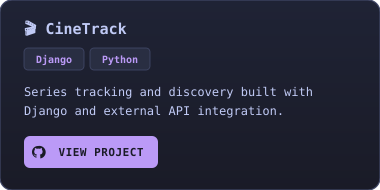
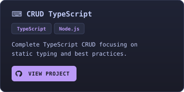
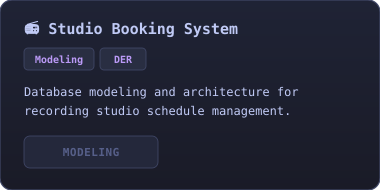
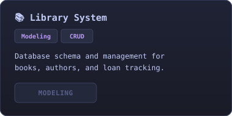

<!-- ╔══════════════════════════════════════════════════════════════╗ -->
<!--                       GABRIEL CAMPOS                         -->
<!-- ╚══════════════════════════════════════════════════════════════╝ -->

 

 

---

## 👨‍💻 About Me

I am a Software Development student focusing mainly on **Fullstack** development and building web applications with **Python and Django**.

Currently expanding my knowledge in web development, REST APIs, database architecture, and clean code best practices.

Passionate about turning knowledge into practical projects and constantly evolving as a developer. 🚀

 

---

## 🎯 Current Focus

* 📚 Studying Fullstack software engineering
* 🐍 Deepening my knowledge in Python
* 🌐 Developing modern web applications with Django
* 🔌 Designing and consuming RESTful APIs
* 🗄️ Database modeling and SQL architecture
* 🔧 Mastering Git and GitHub workflows
* 🚀 Building real-world projects to sharpen my skills

---

## ⚡ Tech Stack

### 💻 Languages & Frameworks

  

### 🗄️ Databases & Infrastructure

  

### ☁️ Cloud & Development Tools

   

---

  

---

  

  
  &nbsp;
  

  
  &nbsp;
  

---

## 📊 GitHub Stats

 

&nbsp;

---

## 🐍 GitHub Contributions

 

<picture>
  <source media="(prefers-color-scheme: dark)" srcset="https://raw.githubusercontent.com/iGabrielCampos/iGabrielCampos/output/github-snake-dark.svg">
  <source media="(prefers-color-scheme: light)" srcset="https://raw.githubusercontent.com/iGabrielCampos/iGabrielCampos/output/github-snake.svg">
  
</picture>

---

## 📫 Connect With Me

 

&nbsp;

  

Feel free to reach out, connect, or explore my projects!

 

 

<b>💡 "Always learning, always evolving." 🚀</b>

